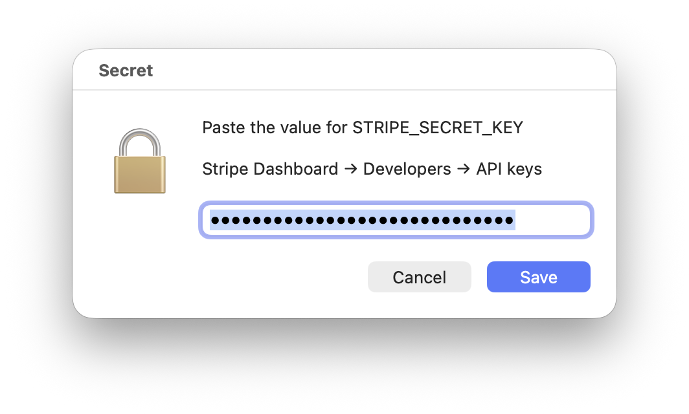
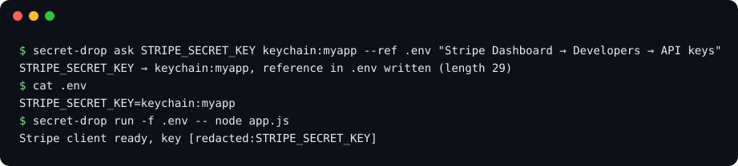
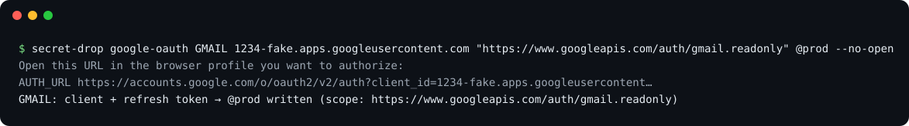

# secret-drop

**Give your AI agent API keys without ever pasting them into the chat, and stop it from reading them back.**

[Türkçe](README.tr.md)


Coding agents like Claude Code and Codex constantly need secrets: a Stripe key, a database password,
an OAuth refresh token. Today that usually means pasting the key into the chat, which writes it into
the transcript, into the model's context and into whatever logs your tooling keeps.

secret-drop closes the whole loop with one file and no dependencies:

1. **Ask.** The agent runs `secret-drop ask`, and a native dialog opens on your screen. You paste the
   key there; the agent only learns its length.
2. **Store.** The value goes to the macOS Keychain (your `.env` keeps a reference like
   `keychain:myapp`), to an env file, to a server over ssh, or into any command, such as your CI's
   secret store.
3. **Use.** `secret-drop run -f .env -- npm start` injects the secrets into the command and redacts
   them from its output.
4. **Guard.** A hook for Claude Code and Codex blocks the agent from reading secret files or the
   keychain behind your back.



## Why secret-drop and not…

There are several tools in this space, and each one solves a slice of the problem. secret-drop is the
only one that covers the full loop (ask → store → use → guard) **and** delivers secrets beyond your
laptop.

| | **secret-drop** | [ask-secret](https://github.com/cuentadesanti/ask-secret) | [secret-cli](https://github.com/stevenenen/secret-cli) | [keyward](https://github.com/arturayupov/keyward) | [claude-secrets](https://github.com/vaultry/claude-secrets) | [1Password CLI](https://developer.1password.com/docs/cli/) |
|---|---|---|---|---|---|---|
| Agent opens a native dialog, you paste there | ✅ | ✅ | ❌ you type in a terminal | ❌ dialog only approves | ✅ | ❌ you use the 1Password app |
| Value never on a command line | ✅ | ✅ | ✅ | ✅ | ⚠️ optional argument | ⚠️ docs warn about it |
| Agent skill | ✅ Claude Code + Codex | ✅ | ❌ | ❌ | ❌ | ✅ beta |
| Guard hook blocks the agent from reading secrets | ✅ Claude Code + Codex | ❌ | ✅ Claude Code only | ❌ | ❌ | ❌ |
| `run` with output scrubbing | ✅ raw, base64, URL-encoded + known key shapes | ❌ no scrubbing | ✅ | ❌ | ❌ no scrubbing | ✅ masking |
| `.env` holds references, not values | ✅ `keychain:` | ❌ plaintext | ❌ | ❌ plaintext | ✅ `secret://` | ✅ `op://` |
| Delivers to a server over ssh or to CI | ✅ | ❌ | ❌ | ❌ | ❌ | ⚠️ AWS sync, beta |
| Runs a command afterwards (restart a service) | ✅ | ❌ | ❌ | ❌ | ❌ | ❌ |
| Google OAuth refresh-token flow | ✅ | ❌ | ❌ | ❌ | ❌ | ❌ |
| Clears the clipboard after the paste | ✅ | ❌ | ❌ | ❌ | ❌ | ? |
| Install | git clone + `install.sh`, Python 3.9 stdlib (ships with macOS) | git clone, zsh | git clone, bash + python3 | Go binary | npm, Node 18+ | app + paid subscription |
| Platforms | macOS (Linux dialog experimental) | macOS | macOS | macOS, Linux, Windows | macOS | macOS, Linux, Windows |
| License | MIT | MIT | MIT | MIT | source-available | proprietary |

**In one line each:**

- **vs ask-secret:** same dialog idea, but its `.env` stays plaintext, nothing stops the agent from
  running `cat .env`, and output isn't scrubbed.
- **vs secret-cli:** a strong guard and scrubber, but you type secrets into a terminal yourself (the
  agent can't ask you), it guards Claude Code only, and secrets never leave your Keychain.
- **vs keyward:** a cross-platform encrypted vault, but you import keys yourself, injected values land
  in a plaintext `.env`, and there is no guard or scrubbing.
- **vs claude-secrets:** references and a dialog, but its MCP `get_secret` hands the plaintext to the
  model, there is no guard, and it isn't open source.
- **vs 1Password CLI:** the right call if your team already pays for it, but it needs the app and a
  subscription, the agent can't collect a new secret from you, and it can't deliver to your server.

Where others are ahead: keyward and 1Password run on Windows and Linux, secret-cli has a larger test
suite, and 1Password syncs across a team. The comparison was made on 2026-10-06 from each project's
own README and source; corrections are welcome.

## Install

```bash
git clone https://github.com/berkbiyikci/secret-drop.git ~/.secret-drop && ~/.secret-drop/install.sh
```

`install.sh` lists every change before making it and asks first:

- it links `secret-drop` into `~/.local/bin` (and adds that folder to your `PATH` if needed);
- for Claude Code and Codex, whichever you have, it links the agent skill and adds the guard hook
  (your existing settings are kept and backed up).

Restart your agent afterwards. In Codex, open `/hooks` once and trust the secret-drop guard.
`secret-drop uninstall` removes everything again. The first time the dialog opens, macOS asks whether
your terminal (or the app running your agent) may control **System Events**; allow it, because that
is how the dialog comes to the front.

## Quick start

You rarely type these yourself; the skill teaches your agent to. But this is the whole flow:

```bash
# 1. ask: the value goes to the Keychain, .env gets a reference that is safe to read
secret-drop ask STRIPE_SECRET_KEY keychain:myapp --ref .env "Stripe Dashboard → Developers → API keys"

# 2. use: injected into the process, scrubbed from its output
secret-drop run -f .env -- node app.js

# 3. see what exists: names only
secret-drop list .env
```



## Commands

### `ask`: one secret into one target

```bash
secret-drop ask NAME TARGET ["hint shown in the dialog"] [--ref FILE] [--then "command"]
```

| Target | What happens |
|---|---|
| `keychain:<service>` | Stores the value in the macOS login keychain (service `<service>`, account `NAME`). With `--ref .env`, also writes `NAME=keychain:<service>` to `.env`. **Recommended.** |
| `file:<path>` (or just a path) | Sets `NAME=value` in an env file: mode `600`, atomic write, added to `.gitignore`. It refuses files that git already tracks. |
| `ssh:<host>:<path>` | The same on a remote host. The value travels over ssh's stdin, never on the command line. Add `--then "ssh <host> sudo systemctl restart app"` to restart the service. |
| `exec:<command>` | Pipes the value into any command, with the name in `$SECRET_DROP_NAME`, e.g. `exec:gh secret set "$SECRET_DROP_NAME"`. The command's stdout is discarded. |
| `@<name>` | A destination from the config file (see below). |

`NAME` must look like an environment variable. The dialog closes on its own after 10 minutes. Exit
codes: `0` saved, `1` cancelled, `2` bad usage, `3` no dialog could open (e.g. inside a sandbox). On
success it prints one line, and clears the clipboard if it still holds the value:

```
STRIPE_SECRET_KEY → keychain:myapp, reference in .env written (length 107, clipboard cleared)
```

### `run`: use secrets without seeing them

```bash
secret-drop run -f .env [-f more.env] -- command [args...]
```

Loads `KEY=value` lines literally (never as shell code), resolves `keychain:` references, and starts
the command with them in its environment. Its stdout and stderr are streamed through a scrubber that
replaces every secret value, including its base64 and URL-encoded forms, with
`[redacted:NAME]`. It also catches well-known key shapes it was never told about: AWS, GitHub, GitLab,
Slack, Google, OpenAI, Anthropic, Stripe, JWTs and private keys. Values that don't look secret (like
`PORT=3000`) are left alone. The exit code is passed through.

### `guard`: stop the agent from reading secrets

`install.sh` registers `secret-drop guard` as a `PreToolUse` hook in Claude Code and Codex. Hook
denials apply even in bypass-permissions mode. The guard blocks:

- reading, grepping or editing secret files: `.env`, `.env.*`, `*.env`, `.envrc`, `.netrc`, `.npmrc`,
  `credentials`, private keys, and every file secret-drop has written to;
- shell commands that touch those files (`cat .env`, `cp .env /tmp/x`, `$(cat .env)`…) or read the
  keychain (`security find-generic-password -w`, `dump-keychain -d`).

It deliberately allows `.env.example` and friends, files that hold only `keychain:` references,
`secret-drop` itself, and harmless commands like `ls` or `cp .env.example .env`. When it blocks
something, it tells the agent what to do instead. Tune it in the config file under `[guard]`.

### `list` and `targets`

`secret-drop list <target>` prints the names in a file, server env file or keychain service, never
the values. `secret-drop targets` lists the destinations you configured.

### `google-oauth`: a refresh token without copy-paste

```bash
secret-drop google-oauth PREFIX CLIENT_ID "SCOPES" TARGET [--no-open] [--reuse-secret] [--ref FILE]
```

This runs Google's consent flow for an OAuth client of type **Desktop app**:

1. It asks for the client secret in the dialog, or with `--reuse-secret` reads it back from the
   target.
2. It listens once on `127.0.0.1` with a `state` check and PKCE.
3. It opens the consent screen, or prints `AUTH_URL …` with `--no-open` so you can pick a browser
   profile.
4. It stores `PREFIX_CLIENT_ID`, `PREFIX_CLIENT_SECRET` and `PREFIX_REFRESH_TOKEN`.



## Configuration

`~/.config/secret-drop/config` (or `$SECRET_DROP_CONFIG`):

```ini
[settings]
lang = en          ; en or tr, defaults to your locale
timeout = 600      ; seconds before the dialog gives up

[target.prod]
target = ssh:deploy@app.example.com:/srv/app/.env
then = ssh deploy@app.example.com sudo systemctl restart app

[target.myapp]
target = keychain:myapp
ref = ~/projects/myapp/.env

[guard]
protect = *.secret, ~/.vault/*   ; extra files to guard
allow = .env.test                ; files the guard should let through
```

`secret-drop targets` shows the destinations, so the agent can pick `@prod` or `@myapp` itself.
Environment variables: `SECRET_DROP_CONFIG`, `SECRET_DROP_LANG`, `SECRET_DROP_TIMEOUT` and
`SECRET_DROP_PROMPTER` (a command that prints the secret instead of opening the dialog; the tests use
it).

## Security

**What it protects**

- **The chat transcript and the model's context:** values are never printed, and `run` scrubs them
  from output.
- **Shell history and the process list:** values never appear on a command line. They reach `ssh`,
  `security` and `exec:` over stdin.
- **Accidental reads by the agent:** the guard blocks the common routes in Claude Code and Codex, and
  `keychain:` references make the `.env` itself harmless.
- **Accidental commits:** secret files go into `.gitignore`, and files git already tracks are refused.
- **The clipboard:** it is cleared after a paste that was stored.

**What it does not protect**

- **A determined agent or malware running as you.** The guard covers the common routes, not every
  possible one (a script that copies a file first, for example). It is a guardrail against mistakes,
  not a sandbox.
- **Anyone with access to your unlocked Mac.** Keychain items written by `security` can be read by
  other `security` calls without a prompt.
- **Clipboard history apps,** which may have already saved the paste before it was cleared.
- **Focus:** the dialog takes keyboard focus when it opens. If you see dots you didn't paste, cancel.

## Platforms

macOS is fully supported and tested. On Linux, `ask`, `run`, `list`, `guard` and the file and ssh
targets work; the dialog falls back to `zenity` or `kdialog` and is **experimental**, and `keychain:`
is macOS only.

## Development

```bash
python3 -m unittest discover -s tests                              # 45 tests, no GUI needed
SECRET_DROP_TEST_KEYCHAIN=1 python3 -m unittest discover -s tests  # also uses the login keychain, then cleans up
python3 docs/make_screenshots.py                                   # regenerate the images in docs/
```

The tests replace the dialog with `SECRET_DROP_PROMPTER`, put a fake `ssh` on `PATH` (and check that
the value never appears in its argv), run the OAuth flow against a local fake token endpoint that
verifies PKCE, feed the guard real hook events, and install into a throwaway `HOME`. Before release,
the skill and the guard were also checked in real Claude Code sessions: the agent picked
`keychain: --ref .env` on its own, and every attempt to read the key was blocked.

**How the images were made.** `docs/make_screenshots.py` opens the real dialog prefilled with a fake
value and captures that one window. It renders the terminal images from real CLI output produced with
fake values, so no real key, host or account appears anywhere. The demo was rendered with
[Remotion](https://www.remotion.dev); its music was generated in code.

## License

MIT
