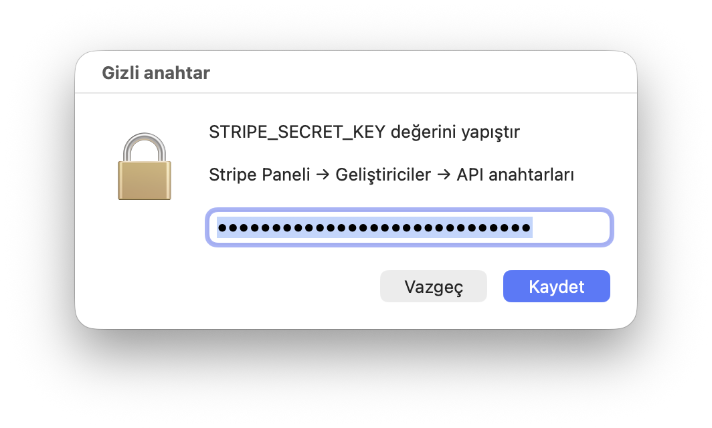
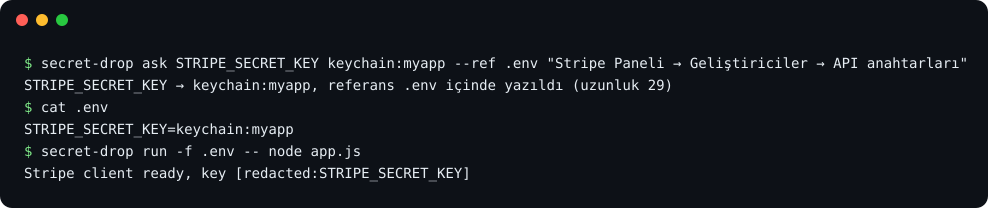
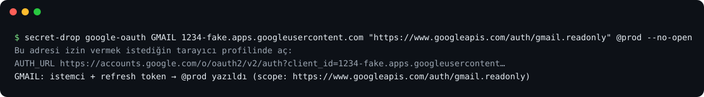

# secret-drop

**AI ajanına API anahtarlarını sohbete yapıştırmadan ver; geri okumasını da engelle.**

🇬🇧 [English](README.md) · 🇹🇷 **Türkçe**


Claude Code ve Codex gibi kodlama ajanları sürekli gizli anahtara ihtiyaç duyar: bir Stripe anahtarı,
bir veritabanı şifresi, bir OAuth refresh token. Bugün bu çoğunlukla anahtarı sohbete yapıştırmak
demek. Anahtar o anda sohbet kaydına, modelin bağlamına ve kullandığın araçların tuttuğu loglara girer.

secret-drop bütün döngüyü tek dosyada ve sıfır bağımlılıkla kapatır:

1. **Sor.** Ajan `secret-drop ask` çalıştırır, ekranında yerel bir pencere açılır. Anahtarı oraya
   yapıştırırsın; ajan yalnızca uzunluğunu öğrenir.
2. **Sakla.** Değer macOS Anahtar Zinciri'ne gider ve `.env` dosyasında yalnızca `keychain:myapp` gibi
   bir referans kalır. İstersen bir env dosyasına, ssh ile bir sunucuya ya da CI'ının secret deposu gibi
   herhangi bir komuta da gönderebilirsin.
3. **Kullan.** `secret-drop run -f .env -- npm start` anahtarları komuta verir ve çıktısından temizler.
4. **Koru.** Claude Code ve Codex için bir hook, ajanın gizli dosyaları ya da Anahtar Zinciri'ni senden
   habersiz okumasını engeller.



## Neden secret-drop, neden diğerleri değil?

Bu alanda birkaç araç var ve her biri sorunun bir parçasını çözüyor. secret-drop bütün döngüyü
(sor → sakla → kullan → koru) kapsayan **ve** anahtarı bilgisayarının dışına da teslim eden tek araç.

| | **secret-drop** | [ask-secret](https://github.com/cuentadesanti/ask-secret) | [secret-cli](https://github.com/stevenenen/secret-cli) | [keyward](https://github.com/arturayupov/keyward) | [claude-secrets](https://github.com/vaultry/claude-secrets) | [1Password CLI](https://developer.1password.com/docs/cli/) |
|---|---|---|---|---|---|---|
| Ajan yerel pencere açar, sen oraya yapıştırırsın | ✅ | ✅ | ❌ terminale kendin yazarsın | ❌ pencere sadece onay ister | ✅ | ❌ 1Password uygulamasını kullanırsın |
| Değer hiç komut satırına girmez | ✅ | ✅ | ✅ | ✅ | ⚠️ argüman olarak da verilebilir | ⚠️ dokümanı uyarıyor |
| Ajan skill'i | ✅ Claude Code + Codex | ✅ | ❌ | ❌ | ❌ | ✅ beta |
| Guard hook ajanın okumasını engeller | ✅ Claude Code + Codex | ❌ | ✅ sadece Claude Code | ❌ | ❌ | ❌ |
| `run` ve çıktı temizleme | ✅ düz, base64, URL-encoded + bilinen anahtar biçimleri | ❌ temizleme yok | ✅ | ❌ | ❌ temizleme yok | ✅ maskeleme |
| `.env` değer değil referans tutar | ✅ `keychain:` | ❌ düz metin | ❌ | ❌ düz metin | ✅ `secret://` | ✅ `op://` |
| ssh ile sunucuya ya da CI'a teslim | ✅ | ❌ | ❌ | ❌ | ❌ | ⚠️ AWS senkronu, beta |
| Ardından komut çalıştırır (servisi yeniden başlatır) | ✅ | ❌ | ❌ | ❌ | ❌ | ❌ |
| Google OAuth refresh token akışı | ✅ | ❌ | ❌ | ❌ | ❌ | ❌ |
| Yapıştırmadan sonra panoyu temizler | ✅ | ❌ | ❌ | ❌ | ❌ | ? |
| Kurulum | git clone + `install.sh`, Python 3.9 stdlib (macOS'la gelir) | git clone, zsh | git clone, bash + python3 | Go binary | npm, Node 18+ | uygulama + ücretli abonelik |
| Platformlar | macOS (Linux penceresi deneysel) | macOS | macOS | macOS, Linux, Windows | macOS | macOS, Linux, Windows |
| Lisans | MIT | MIT | MIT | MIT | kaynağı açık, OSI değil | kapalı |

**Her birine karşı tek cümleyle:**

- **ask-secret'a karşı:** Aynı pencere fikri. Ama `.env` düz metin kalıyor, ajanın `cat .env`
  çalıştırmasını engelleyen bir şey yok ve çıktı temizlenmiyor.
- **secret-cli'a karşı:** Güçlü bir guard ve temizleyici var. Ama anahtarı terminale kendin yazıyorsun
  (ajan senden isteyemiyor), yalnızca Claude Code'u koruyor ve anahtarlar Anahtar Zinciri'nden dışarı
  çıkamıyor.
- **keyward'a karşı:** Çok platformlu, şifreli bir kasa. Ama anahtarları kendin içeri aktarıyorsun,
  enjekte edilen değerler düz metin `.env`'ye yazılıyor; guard da temizleme de yok.
- **claude-secrets'a karşı:** Referans ve pencere var. Ama MCP'deki `get_secret` düz metni modele
  veriyor, guard yok ve açık kaynak değil.
- **1Password CLI'a karşı:** Ekibin zaten ödüyorsa doğru tercih. Ama uygulama ve abonelik gerektiriyor,
  ajan senden yeni bir anahtar toplayamıyor ve sunucuna teslim edemiyor.
- **[secure-secret-drop](https://github.com/moeadham/secure-secret-drop) ve
  [Rendiere/secretdrop](https://github.com/Rendiere/secretdrop)'a karşı:** Ajan sana tek seferlik bir web
  linki veriyor (Cloudflare tüneli ya da Tailscale üzerinden), değer düz metin bir dosyaya yazılıyor. Bu
  yalnızca sorma adımını karşılıyor: Keychain, guard, temizleme ya da o dosyanın ötesine teslim yok.

Diğerlerinin önde olduğu yerler de var:
- O iki link tabanlı araç, ajan uzak bir makinede çalışırken ve sen telefondayken de işe yarıyor;
  secret-drop'un penceresi ise Mac'inin ekranına ihtiyaç duyuyor.
- keyward ve 1Password Windows ve Linux'ta çalışıyor.
- secret-cli'ın test paketi daha büyük.
- 1Password ekipler arasında senkronize ediyor. Karşılaştırma 2026-10-06'da her
projenin kendi README'si ve kaynak kodu okunarak yapıldı; düzeltmelere açığız.

## Kurulum

```bash
git clone https://github.com/berkbiyikci/secret-drop.git ~/.secret-drop && ~/.secret-drop/install.sh
```

`install.sh` her değişikliği önce listeler, sonra onay ister:

- `secret-drop`'u `~/.local/bin`'e bağlar (gerekirse bu klasörü `PATH`'ine ekler);
- Claude Code ve Codex'ten hangileri kuruluysa onlara ajan skill'ini bağlar ve guard hook'u ekler.
  Diğer hook'ların ve ayarların korunur, orijinal dosya bir kez yedeklenir. Geçerli JSON olmayan bir
  ayar dosyası, hiçbir şey değişmeden kurulumu durdurur.

Ardından ajanını yeniden başlat. Codex'te bir kez `/hooks` ekranını açıp secret-drop guard'a güven.
`secret-drop uninstall` bağlantıları ve guard hook'u kaldırır. PATH satırı, yedekler ve
`~/.config/secret-drop` yerinde kalır. Pencere ilk açıldığında macOS, terminalinin (ya da ajanı
çalıştıran uygulamanın) **System Events**'i kontrol etmesine izin verip vermeyeceğini sorar. İzin ver;
pencere bu sayede öne gelir.

## Hızlı başlangıç

Bunları genelde kendin yazmazsın; skill ajanına öğretir. Ama bütün akış şu:

```bash
# 1. sor: değer Anahtar Zinciri'ne gider, .env okunması güvenli bir referans alır
secret-drop ask STRIPE_SECRET_KEY keychain:myapp --ref .env "Stripe Paneli → Geliştiriciler → API anahtarları"

# 2. kullan: süreç ortamına verilir, çıktıdan temizlenir
secret-drop run -f .env -- node app.js

# 3. neler var bak: sadece adlar
secret-drop list .env
```



## Komutlar

### `ask`: tek anahtar, tek hedef

```bash
secret-drop ask AD HEDEF ["pencerede görünen ipucu"] [--ref DOSYA] [--then "komut"]
```

| Hedef | Ne olur |
|---|---|
| `keychain:<servis>` | Değeri macOS giriş anahtar zincirine yazar (servis `<servis>`, hesap `AD`). `--ref .env` verilirse `.env`'ye `AD=keychain:<servis>` de yazar. **Önerilen.** |
| `file:<yol>` (ya da sadece yol) | Bir env dosyasında `AD=değer` satırını yazar: izin `600`, atomik yazma, `.gitignore`'a eklenir. Git'in zaten izlediği dosyaları reddeder. |
| `ssh:<host>:<yol>` | Aynısını uzak makinede yapar. Değer ssh'e stdin'den gider, komut satırına hiç girmez. Symlink'li bir env dosyası takip edilir, var olan dosya iznini ve grubunu korur; yeni dosya `600` olur. Servisi yeniden başlatmak için `--then "ssh <host> sudo systemctl restart app"` ekle. |
| `exec:<komut>` | Değeri herhangi bir komuta stdin'den verir, ad `$SECRET_DROP_NAME` içinde olur. Ör. `exec:gh secret set "$SECRET_DROP_NAME"`. Komutun stdout'u atılır. |
| `@<ad>` | Config dosyasında tanımlı bir hedef (aşağıda). |

`AD` bir ortam değişkeni gibi olmalı. Pencere 10 dakika sonra kendiliğinden kapanır. Çıkış kodları:
`0` kaydedildi, `1` vazgeçildi ya da süre doldu, `2` hatalı kullanım, `3` pencere açılamadı (ör. sandbox
içinde), `4` başka bir şey ters gitti.
Başarılı olunca tek satır yazar; pano hâlâ değeri tutuyorsa panoyu da temizler:

```
STRIPE_SECRET_KEY → keychain:myapp, referans .env içinde yazıldı (uzunluk 107, pano temizlendi)
```

### `run`: anahtarları görmeden kullan

```bash
secret-drop run -f .env [-f diger.env] -- komut [argümanlar...]
```

`AD=değer` satırlarını harfiyen okur; shell kodu olarak asla çalıştırmaz. `keychain:` referanslarını
çözer ve komutu bu değerler ortamındayken başlatır. Komutun stdout ve stderr çıktıları bir temizleyiciden
geçer: her anahtar değeri, URL-encoded ve base64 halleri dahil, `[redacted:AD]` ile değiştirilir.
Base64'te konumu fark etmez; Basic-auth başlığındaki `user:ANAHTAR` da yakalanır. İki parçaya bölünerek
yazılan bir değer, kontrol edilebilene kadar bekletilir.

Kendisine hiç söylenmemiş bilinen anahtar biçimlerini de yakalar: AWS access key ID'leri, GitHub, GitLab,
Slack, Google, OpenAI, Anthropic, Stripe, JWT ve özel anahtar blokları. Anahtar Zinciri'nden ya da
secret-drop'un yazdığı dosyalardan gelen değerler her zaman temizlenir. Diğerlerinde yalnızca açıkça
yapılandırma olan değerlere (sayılar, true/false, `production` gibi kelimeler, düz URL'ler) dokunulmaz.
Komutun çıkış kodu aynen döner.

### `guard`: ajanın anahtarları okumasını engelle

`install.sh`, `secret-drop guard`'ı Claude Code ve Codex'e `PreToolUse` hook'u olarak kaydeder. Hook'un
engellemeleri bypass izin modunda bile geçerlidir. Guard şunları engeller:

- gizli dosyaları okumayı, içinde aramayı ya da düzenlemeyi: `.env`, `.env.*`, `*.env`, `.envrc`,
  `.netrc`, `.npmrc`, `credentials`, özel anahtarlar ve secret-drop'un yazdığı her dosya (symlink
  üzerinden ya da farklı harf büyüklüğüyle erişilse bile);
- bu dosyaları okuyan shell komutlarını, ad nerede geçerse geçsin:
  - doğrudan okuma: `cat .env`, `cd api && head .env`
  - başka bir yorumlayıcı içinden: `bash -c '…'`, `python3 -c "open('.env')"`, `$(cat .env)`
  - commit'e sokma: `git add .env`
  - bu dosyaları içeren bir klasörde özyinelemeli `grep`
  - `secret-drop run` ve `--then`'in çalıştıracağı komutlar;
- Anahtar Zinciri'ni okumayı (`security find-generic-password -w`, `dump-keychain -d`).

Şunlara bilerek izin verir:
- `.env.example` ve benzerleri;
- yalnızca `keychain:` referansı ve düz yapılandırma tutan dosyalar;
- anahtar yazdırmayan günlük komutlar: `ls`, `[ -f .env ]`, `echo .env >> .gitignore`,
  `git rm --cached .env`, `git commit -m "…"`, `ssh -i`, `docker compose --env-file`,
  `cp .env.example .env`.

Bir şeyi engellediğinde ajana onun yerine ne yapması gerektiğini söyler. Bozuk bir config onu asla
kapatmaz. Config dosyasında `[guard]` altından ayarlanır.

### `list` ve `targets`

`secret-drop list <hedef>` bir dosyadaki, sunucudaki env dosyasındaki ya da bir Anahtar Zinciri
servisindeki adları yazdırır; değerleri asla. `secret-drop targets` tanımladığın hedefleri listeler.

### `google-oauth`: kopyala-yapıştırsız refresh token

```bash
secret-drop google-oauth ÖNEK CLIENT_ID "SCOPE'LAR" HEDEF [--no-open] [--reuse-secret] [--ref DOSYA]
```

**Desktop app** türündeki bir OAuth istemcisi için Google izin akışını yürütür:

1. Client secret'ı pencereden ister; `--reuse-secret` verilirse hedeften geri okur.
2. `127.0.0.1` üzerinde, `state` kontrolü ve PKCE ile bir kez dinler.
3. İzin ekranını açar. `--no-open` ile `AUTH_URL …` satırını yazdırır; böylece istediğin tarayıcı
   profilini seçebilirsin.
4. `ÖNEK_CLIENT_ID`, `ÖNEK_CLIENT_SECRET` ve `ÖNEK_REFRESH_TOKEN` değerlerini saklar.



## Yapılandırma

Config dosyası `~/.config/secret-drop/config` konumunda durur; `$SECRET_DROP_CONFIG` ile başka bir yer
gösterebilirsin:

```ini
[settings]
lang = tr          ; en ya da tr; varsayılan sistem dili
timeout = 600      ; pencerenin kaç saniye sonra kapanacağı

[target.prod]
target = ssh:deploy@app.example.com:/srv/app/.env
then = ssh deploy@app.example.com sudo systemctl restart app

[target.myapp]
target = keychain:myapp
ref = ~/projects/myapp/.env

[guard]
protect = *.secret, ~/.vault/*   ; korunacak ek dosyalar
allow = .env.test                ; guard'ın geçireceği dosyalar
```

`secret-drop targets` hedefleri gösterir; ajan `@prod` ya da `@myapp`'i kendisi seçebilir. Ortam
değişkenleri: `SECRET_DROP_CONFIG`, `SECRET_DROP_LANG`, `SECRET_DROP_TIMEOUT` ve
`SECRET_DROP_PROMPTER`. Sonuncusu, pencere yerine anahtarı yazdıran bir komut tanımlar; testler bunu
kullanıyor.

## Güvenlik

**Neyi korur**

- **Sohbet kaydını ve modelin bağlamını:** Değerler hiçbir zaman yazdırılmaz; `run` onları çıktıdan da
  temizler.
- **Shell geçmişini ve process listesini:** Değerler hiçbir zaman komut satırına girmez. `ssh`'e,
  `security`'ye ve `exec:` komutlarına stdin'den gider.
- **Ajanın kazara okumasını:** Guard, Claude Code ve Codex'teki yaygın yolları kapatır. `keychain:`
  referansları sayesinde `.env` dosyasının kendisi de zararsız hale gelir.
- **Kazara commit'i:** Gizli dosyalar `.gitignore`'a eklenir; git'in zaten izlediği dosyalara yazmaz.
- **Panoyu:** Saklanan bir yapıştırmadan sonra pano temizlenir.

**Neyi korumaz**

- **Senin kullanıcınla çalışan kararlı bir ajanı ya da zararlı yazılımı.** Guard yaygın yolları kapatır,
  olası her yolu değil: diske yazılıp sonra çalıştırılan bir script, `find … | xargs cat` ya da bir MCP
  aracı bunlara örnek. Hatalara karşı bir korkuluktur, sandbox değildir.
- **Kilidi açık Mac'ine erişimi olan birini.** `security` ile yazılan Anahtar Zinciri kayıtları başka
  `security` çağrılarıyla onay sorulmadan okunabilir.
- **Pano geçmişi tutan uygulamaları.** Bunlar yapıştırılan değeri pano temizlenmeden önce kaydetmiş
  olabilir.
- **Odağı.** Pencere açılınca klavye odağını alır. Yapıştırmadığın noktalar görürsen vazgeç.

## Platformlar

macOS tam destekli ve test edildi. Linux'ta `ask`, `run`, `list`, `guard` ve dosya ile ssh hedefleri
çalışır. Pencere `zenity` ya da `kdialog` ile açılır ve bu yol **deneysel**; `keychain:` yalnızca
macOS'ta var.

## Geliştirme

```bash
python3 -m unittest discover -s tests                              # 63 test, GUI gerekmez
SECRET_DROP_TEST_KEYCHAIN=1 python3 -m unittest discover -s tests  # giriş anahtar zincirini de kullanır, sonra temizler
python3 docs/make_screenshots.py                                   # docs/ görsellerini yeniden üretir
```

Testlerde:
- pencerenin yerini `SECRET_DROP_PROMPTER` alır;
- `PATH`'e sahte bir `ssh` konur ve değerin argv'sinde hiç görünmediği kontrol edilir;
- OAuth akışı, PKCE'yi doğrulayan yerel bir sahte token servisine karşı çalışır;
- guard'a gerçek hook olayları verilir;
- kurulum geçici bir `HOME` içine yapılır.

Yayından önce bağımsız bir inceleme guard'ı, temizleyiciyi ve kurulumu kırmaya çalıştı. Bulduğu her
sorun artık bir regresyon testi (`ReviewRegressions`).

Skill ve guard gerçek Claude Code oturumlarında da denendi. Ajan `keychain: --ref .env` yolunu kendisi
seçti; anahtarı okumaya yönelik her denemesi engellendi.

Codex hook'u, Codex'in dokümante edilmiş olay formatını izliyor; ama henüz canlı bir Codex oturumunda
denenmedi.

**Görseller nasıl üretildi?** `docs/make_screenshots.py` gerçek pencereyi sahte bir değerle önceden
doldurulmuş halde açar ve yalnızca o pencereyi yakalar. Terminal görsellerini sahte değerlerle alınmış
gerçek CLI çıktısından üretir; bu yüzden hiçbir yerde gerçek bir anahtar, sunucu ya da hesap görünmez.
Demo [Remotion](https://www.remotion.dev) ile render edildi; müziği kodla üretildi.

## Karıştırmayın

"Secret drop" popüler bir isim. Şunlar farklı projeler:
- [bilustek/secretdrop](https://github.com/bilustek/secretdrop): secretdrop.us, insanlar arası tek seferlik
  anahtar paylaşımı.
- [SecretDrop.io](https://github.com/Calvin-LL/SecretDrop.io): tarayıcıda açık anahtarlı şifreleme.
- Yukarıda karşılaştırılan, ajanlara link veren araçlar.

## Lisans

MIT
